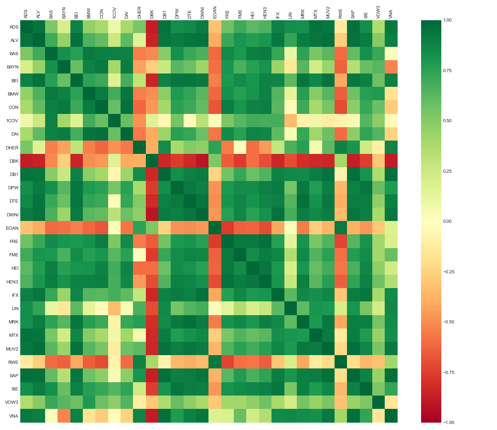
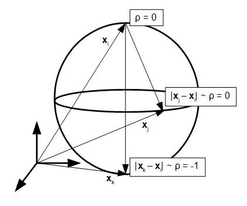

# Multidimensional Scaling for the 3d visualization of the dynamical propagation of correlations in stock's closing prices

The approach taken will make use of two python scripts `corrMDS.py` and `stock_data_collection_tools.py`. The first program contains the class and its methods for transforming a dataframe of time series objects into a 3d trajectory. The second one is a collection of functions necessary for retrieving and processing closing prices for the german DAX index and has been adopted almost one to one from Kinsleys's Youtube Playlist on [Python Programming for Finance](https://www.youtube.com/playlist?list=PLQVvvaa0QuDcOdF96TBtRtuQksErCEBYZ).

In the following, I will discuss the motivation and the problem of transforming the correlation structure of time series, specifically stock prices, into a configuration of points in an abstract 3d cartesian space for a holistic visualization approach of the statistical relationship between them. I will make a few remarks on the package dependencies and I will link their respective documentation pages afterwards. A user guide is added, explaining the procedure by applying multidimensional scaling to the correlation structure of daily stock closing prices for the german DAX index for the past 10 years. I will conclude with an API reference, giving an overiew of the class and its methods.

## Table of Contents

- [Introduction](#introduction)
- [Package Dependencies](#package-dependencies)
- [User Guide](#user-guide)
- [API Reference](#api-reference)

## Introduction

### Correlation matrices

Although quite easy to compute, the inference of information from correlation matrices can get messy, once we want to get a birds eye view on the correlation structure as a whole and are not only interested in pairwise dependencies. While it might be possible to get an overall feeling for the correlations of a few time series, it gets increasingly more difficult for larger collections as the number of pairwise correlations for $`n`$ time series grows as $`\Omicron(n^2)`$. For that matter, considering the case of time dependent correlations, the problem gets even worse. A typicall correlation matrix is shown in the following graphic for some stocks of the german DAX index.




### Distance metric

The following is an experimental attempt to tackle this issue by trying to find a sensible mapping from a given correlation matrix into an abstract 3d cartesian space, that provides additional information. Therefore, correlation has to be set in a relationship with an appropriate distance metric. Before choosing the metric, we have to ask ourselves in what way a specific pairwise correlation $`\rho_{ij}`$ should correspond to a certain distance $`d_{\rho}(i,j)`$ between two point coordinates $`\bold{x}_{i}`$, $`\bold{x}_{j}`$.

At first, it seems quite intuitive to make the assumption that time series with high positive correlation should correspond to nearby points and in the case of uncorrelated time series, the points should be far apart. The complication arises, when we deal with negative correlations. One solution is to conider only the magnitude $`\lvert\rho\rvert`$, thereby mapping positive and negative correlations with the same value onto the same coordinate. We would like to avoid this information loss in the resulting respresentation and assume the following implied manifold for the abstract space instead.   

Consider a 2d sphere embedded in 3d space as in the figure below with vectors $`\bold{x}_{i}`$, $`\bold{x}_{j}`$ and $`\bold{x}_{k}`$. Let us analyze the pairwise correlations with respect to $`\bold{x}_{i}`$.    


 
In this representation, $`\bold{x}_{i}`$ sits at the pole of the sphere and points with high positive correlation will lie in its vicinity on the upper hemisphere. Here, spheric sections correspond to circles of constant correlation, with the great circle corresponding points of zero correlation, i.e. $`\bold{x}_{j}`$. Now, the antipodal point of $`\bold{x}_{i}`$ given by $`\bold{x}_{k}`$ represents a perfect negative correlation and points within its vicinity on the lower represent overall negative correlation. A distance metric that enables this representation is given by

```math
d_{\rho}(i,j) = \sqrt{2(1-\rho_{ij})}
```

The above choice, although sensible will not guarantee a perfect mapping onto a sphere. The resulting manifold will resemble more a general ellipsoid and the coordinates will deviate from its surface. The implementation of a gradient descent in the following section is easier to compute with the constraint of a spherical surface removed. Moreover, the assumption of the above manifold is not backed up by the data and should only serve as a guiding blueprint in the following steps.

### Gradient descent

In the following, we will define the loss function $`J`$ which is going to be minimized, given:
- an initial correlation matrix $`d_{\rho}(i,j)`$ of $`n`$ time series
- a random configurations of cartesian coordiantes $`\bold{x}_{1},\dots,\bold{x}_{n}\in\R`$, arranged in the matrix
```math
\bold{X} = [\bold{x}_{1},\dots,\bold{x}_{n}]^{T}
```
- a number of epochs $`k\in1,\dots,K`$

- the learning rate $`\lambda`$

Let the euclidean distance between two vectors $`\bold{x}_{i}`$ and $`\bold{x}_{j}`$ be given by

```math
d_{\bold{x}}(i,j) = \sqrt{(x_{i}-x_{j})^2 + (y_{i}-y_{j})^2 + (z_{i}-z_{j})^2}
```

with $`\bold{x}_{i} = [x_{i},y_{i},z_{i}]^{T}`$ and where the bold index $`\bold{x}`$ distinguishes this distance form the distance metric above. We want to minimize the difference in distance between our derived distance metric and the euclidean distance of cofiguration vectors $`\varepsilon_{ij} = d_{\bold{x}}(i,j) -  d_{\rho}(i,j)`$. This allows for the definition of a convex loss function

```math
J = \sum_{i,j} \varepsilon_{ij}^2 = \sum_{i,j} (d_{\bold{x}}(i,j) -  d_{\rho}(i,j))^2
```

The gradient of this loss with respect to each vector $`\bold{x}_{i}`$ is given by

```math
\nabla_{i}J = \sum_{i,j} \nabla_{i} (\varepsilon_{ij})^2 
```

By the chain rule, each term in the sum can be written as

```math
\nabla_{i} (\varepsilon_{ij})^2 = 2 \varepsilon_{ij}\cdot\nabla_{i}\varepsilon_{ij}
```

Expanding $`\varepsilon_{ij}`$ in terms of the distances and noting that $`d_{\rho}(i,j)`$ is fixed, we get
```math
\nabla_{i}\varepsilon_{ij} = \nabla_{i} d_{\bold{x}}(i,j) = \frac{\bold{x}_{i}-\bold{x}_{j}}{d_{\bold{x}}(i,j)}
```

leading to an overall expression for the loss gradient

```math
\nabla_{i}J = 2\sum_{i,j}\frac{\varepsilon_{ij}}{d_{\bold{x}}(i,j)}\cdot(\bold{x}_{i}-\bold{x}_{j})
```

For compactness let us define $`\nabla\bold{J} = \begin{bmatrix}  (\nabla_{1}J)^{T} \\ \dots \\(\nabla_{n}J)^{T} \end{bmatrix}`$


## Package Dependencies

## User Guide

## API Reference