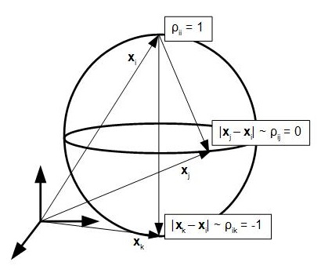

# Multidimensional Scaling for the 3d visualization of the dynamic propagation of correlations in stock's closing prices

The approach taken will make use of two python scripts `corrMDS.py` and `stock_data_collection_tools.py`. The first program contains the class and its methods for transforming a dataframe of time series objects into a 3d trajectory. The second one is a collection of functions necessary for retrieving and processing closing prices for the german DAX index and has been adopted almost one to one from Kinsleys's Youtube Playlist on [Python Programming for Finance](https://www.youtube.com/playlist?list=PLQVvvaa0QuDcOdF96TBtRtuQksErCEBYZ).

In the following, I will discuss the motivation and the problem of transforming the correlation structure of time series, specifically stock prices, into a configuration of points in an abstract 3d cartesian space for a holistic visualization approach of the statistical relationship between them. I will make a few remarks on the package dependencies and I will link their respective documentation pages afterwards. A user guide is added, explaining the procedure by applying multidimensional scaling to the correlation structure of daily stock closing prices for the german DAX index for the past 10 years. I will conclude with an API reference, giving an overiew of the class and its methods.

## Table of Contents

- [Introduction](#introduction)
- [Package Dependencies](#package-dependencies)
- [User Guide](#user-guide)
- [API Reference](#api-reference)

## Introduction

### Correlation matrices

Although quite easy to compute, the inference of information from correlation matrices can get messy, once we want to get a birds eye view on the correlation structure as a whole and are not only interested in pairwise dependencies. While it might be possible to get an overall feeling for the correlations of a few time series, it gets increasingly more difficult for larger collections as the number of pairwise correlations for $`n`$ time series grows as $`\Omicron(n^2)`$. For that matter, considering the case of time dependent correlations, the problem gets even worse. A typicall correlation matrix is shown in the following graphic for some stocks of the german DAX index.


### Distance metric

The following is an experimental attempt to tackle this issue by trying to find a sensible mapping from a given correlation matrix into an abstract 3d cartesian space, that provides additional information. Therefore, correlation has to be set in a relationship with an appropriate distance metric. Before choosing the metric, we have to ask ourselves in what way a specific pairwise correlation $`\rho_{ij}`$ should correspond to a certain distance $`d_{\rho}(i,j)`$ between two point coordinates $`\bold{x}_{i}`$, $`\bold{x}_{j}`$.

At first, it seems quite intuitive to make the assumption that time series with high positive correlation should correspond to nearby points and in the case of uncorrelated time series, the points should be far apart. The complication arises, when we deal with negative correlations. One solution is to conider only the magnitude $`\lvert\rho\rvert`$, thereby mapping positive and negative correlations with the same value onto the same coordinate. We would like to avoid this information loss in the resulting respresentation and assume the following implied manifold for the abstract space instead.   

Consider a 2d sphere embedded in 3d space as in the figure below with vectors $`\bold{x}_{i}`$, $`\bold{x}_{j}`$ and $`\bold{x}_{k}`$. Let us analyze the pairwise correlations with respect to $`\bold{x}_{i}`$.    


 
In this representation, $`\bold{x}_{i}`$ sits at the pole of the sphere and points with high positive correlation will lie in its vicinity on the upper hemisphere. Here, spheric sections correspond to circles of constant correlation, with the great circle corresponding points of zero correlation, i.e. $`\bold{x}_{j}`$. Now, the antipodal point of $`\bold{x}_{i}`$ given by $`\bold{x}_{k}`$ represents a perfect negative correlation and points within its vicinity on the lower represent overall negative correlation. A distance metric that enables this representation is given by

```math
d_{\rho}(i,j) = \sqrt{2(1-\rho_{ij})}
```

The above choice, although sensible will not guarantee a perfect mapping onto a sphere. The resulting manifold will resemble more a general ellipsoid and the coordinates will deviate from its surface. The implementation of a gradient descent in the following section is easier to compute with the constraint of a spherical surface removed. Moreover, the assumption of the above manifold is not backed up by the data and should only serve as a guiding blueprint in the following steps.

### Gradient descent

In the following, we will define the loss function $`J`$ which is going to be minimized, given:
- an initial correlation matrix $`d_{\rho}(i,j)`$ of $`n`$ time series
- a random configurations of cartesian coordiantes $`\bold{x}_{1},\dots,\bold{x}_{n}\in\R`$, arranged in the matrix
```math
\bold{X} = [\bold{x}_{1},\dots,\bold{x}_{n}]^{T}
```
- a number of epochs $`k\in1,\dots,K`$

- the learning rate $`\lambda`$

Let the euclidean distance between two vectors $`\bold{x}_{i}`$ and $`\bold{x}_{j}`$ be given by

```math
d_{\bold{x}}(i,j) = \sqrt{(x_{i}-x_{j})^2 + (y_{i}-y_{j})^2 + (z_{i}-z_{j})^2}
```

with $`\bold{x}_{i} = [x_{i},y_{i},z_{i}]^{T}`$ and where the bold index $`\bold{x}`$ distinguishes this distance form the distance metric above. We want to minimize the difference in distance between our derived distance metric and the euclidean distance of cofiguration vectors $`\varepsilon_{ij} = d_{\bold{x}}(i,j) -  d_{\rho}(i,j)`$. This allows for the definition of a convex loss function

```math
J = \sum_{i,j} \varepsilon_{ij}^2 = \sum_{i,j} (d_{\bold{x}}(i,j) -  d_{\rho}(i,j))^2
```

The gradient of this loss with respect to each vector $`\bold{x}_{i}`$ is given by

```math
\nabla_{i}J = \sum_{i,j} \nabla_{i} (\varepsilon_{ij})^2 
```

By the chain rule, each term in the sum can be written as

```math
\nabla_{i} (\varepsilon_{ij})^2 = 2 \varepsilon_{ij}\cdot\nabla_{i}\varepsilon_{ij}
```

Expanding $`\varepsilon_{ij}`$ in terms of the distances and noting that $`d_{\rho}(i,j)`$ is fixed, we get
```math
\nabla_{i}\varepsilon_{ij} = \nabla_{i} d_{\bold{x}}(i,j) = \frac{\bold{x}_{i}-\bold{x}_{j}}{d_{\bold{x}}(i,j)}
```

leading to an overall expression for the loss gradient

```math
\nabla_{i}J = 2\sum_{i,j}\frac{\varepsilon_{ij}}{d_{\bold{x}}(i,j)}\cdot(\bold{x}_{i}-\bold{x}_{j})
```

For compactness let us define
```math
 \nabla\bold{J} = \begin{bmatrix}  (\nabla_{1}J)^{T} \\ \vdots \\(\nabla_{n}J)^{T} \end{bmatrix}
 ```
Updating the coordinate matrix $`\bold{X}`$ after one epoch $`k\to k+1`$ of gradient descent is thus given by
```math
\bold{X}^{k+1} = \bold{X}^{k} - \lambda\cdot\nabla\bold{J}^{k}
``` 

where we added the upper index for the respective epoch. Thus after each step, the coordinates get updated and in return the distances $`d_{\bold{x}}(i,j)`$.  

### Dynamic propagation

We are interested in correlation changes over time. This can be achieved by computing the correlation matrix within a moving window, by setting a certain window and step size. By default we will consider step sizes of one week. The choice of the window size is a delicate one, as it will have a direct impact on how smooth correlation will vary over time. In the current setting, windows of 6 months are considered. 

Let the time dependence be given by the index $`t\in 1,\dots,T`$ which should not be confused with the epoch index $`k\in 1,\dots,K`$. Keep in mind that one whole gradient descent is performed at each time $`t`$. The procedure in the precious section has the donwside that the initial configuration of coordinate points is initialized randomly and that the final vectors, given only the distances from the correlation matrix as an input, are unique only up to rotation. To mitigate this problem, lets assume the following procedure.   

At time $`t`$ given the corrdinate matrix $`\bold{X}_{t}^{1}`$ in the first epoch, perform the gradient descent until epoch $`K`$ (or until a reasonable stopping criterion is triggered) 

```math
\bold{X}_{t}^{1} \xrightarrow[descent]{gradient} \bold{X}_{t}^{K} 
```

Then, in going from $`t`$ to $`t+1`$, set 

```math
\bold{X}_{t+1}^{1} = \bold{X}_{t}^{K} 
```

thus allowing the previous coordinates to be the input for the following optimization. Again, the quality of the resulting trajectories will depend on the choice in window size. A wide window will lead to less variability in the change of correlation and smoother trajectories than a short one.   

## Package Dependencies

The correlation analyzis described in the previous section as well as the process for retrieving the time series data are implemented using the following libraries.

- [beautifulsoup4](https://www.crummy.com/software/BeautifulSoup/bs4/doc/) used for webscraping the stock ticker symbols
- [datetime](https://docs.python.org/3/library/datetime.html) basic date and time types
- [matplotlib](https://matplotlib.org/) create static and interactive visualizations
- [mpl_toolkits](https://matplotlib.org/mpl_toolkits/index.html) extentions for matplotlib, needed for updating interactive trajectory plot 
- [numpy](https://numpy.org/doc/stable/) the go-to library for mathematical calculations, used for computing the gradient 
- [pandas](https://pandas.pydata.org/pandas-docs/stable/) the go-to library for data analysis, used for the import of data tables and their manipulation
- [pandas_datareader](https://pandas-datareader.readthedocs.io/en/latest/) remote data access for OHLC stock prices from [Yahoo!Finance](https://finance.yahoo.com)
- [pickle](https://docs.python.org/3/library/pickle.html) object serialisation, used for ticker symbols
- [requests](https://requests.readthedocs.io/en/master/) sending http requests 
- [tqdm](https://tqdm.github.io/) visualize progress bar
- [os](https://docs.python.org/3/library/os.html) check for existing directories when retrieving stock data

## User Guide

The usage of `stock_data_collection_tools.py` and `corrMDS.py` are displayed by considering the case of retrieving the adjusted closing prices for the german DAX index of the past 10 years. They are visualized using MDS on the correlation metric for different times, thereby obtaining interactive 3d configuration plots. This section follows the implementation, as showcased in the [testscript](Testscript.ipynb).  

First, import the necessary scripts and packages.

```python
from corrMDS import corrMDS
import matplotlib.pyplot as plt
import pandas as pd
import stock_data_collection_tools as stct

plt.style.use('seaborn-darkgrid') #set the plot style
```

We start by retrieving the relevant ticker symbols for the DAX index, which are then saved as a pickle file. Subsequently, this file is used to get the OHLC prices from yhaoo finance and save a csv file for each stock in the generated sub folder `dax_stock_dfs`.

```python
sdct.save_dax_tickers()
sdct.get_dax_from_yahoo()
```

The data aggregation is finished by creating a joint table of the adjusted closing prices for each stock.

```python
sdct.compile_dax()
```

>>>
**NOTE**
The functions in `stock_data_collection_tools` can be easily adjusted to retrieve other indices. For a more detailed explanation, see Kinsleys's Youtube Playlist on [Python Programming for Finance](https://www.youtube.com/playlist?list=PLQVvvaa0QuDcOdF96TBtRtuQksErCEBYZ).
>>>

The following function allows for the visualization of the correlation matrix, as showcased in the [introduction](#correlation-matrices). 

## API Reference